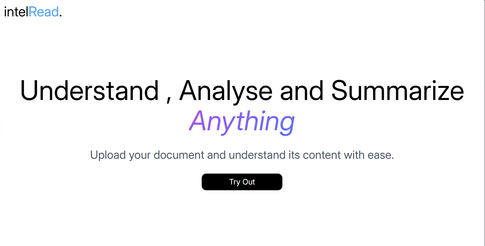
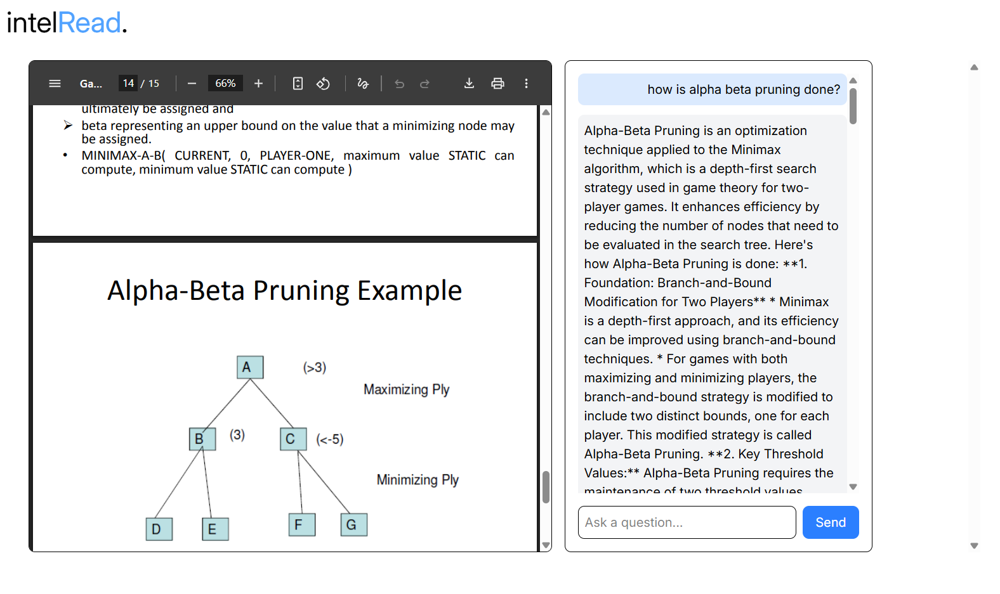

# IntellRead — RAG-Based Reader

IntellRead is a Retrieval-Augmented Generation (RAG) system that lets you upload a PDF and ask questions about it. It combines a Gemini-powered LLM with a Chroma vector database for semantic search, so answers are grounded in the actual document content instead of the model's general knowledge.

Built with **Python, FastAPI, ReactJS, Gemini API, ChromaDB**.

---

## Demo





---

## How RAG works (in this project)

1. **Ingestion** — a PDF is uploaded, split page-by-page, and each page is chunked (`chunk_size=800`, `chunk_overlap=100`) using LangChain's `RecursiveCharacterTextSplitter`. Each chunk keeps metadata for its source filename, page number, and chunk index.
2. **Embedding & storage** — each chunk is embedded (`all-MiniLM-L6-v2` via HuggingFace) and stored in a persistent Chroma collection.
3. **Retrieval** — a user's question is embedded and compared against stored chunks via similarity search. The top-k (`k=4`) closest chunks are retrieved, along with their distance scores.
4. **Confidence filtering** — chunks with a distance score above a calibrated threshold are discarded rather than passed to the LLM as context. If nothing passes the bar, the system says so instead of guessing.
5. **Generation** — the retrieved, filtered context is injected into a strict grounding prompt and sent to Gemini (`gemini-2.5-flash`), which answers using only that context.
6. **Response** — the answer is returned along with its source chunks (filename, page, similarity score), so answers are traceable back to the document.

### Strict vs. Hybrid mode

The assistant supports two answering modes, toggled per question:

- **Strict (default):** answers only from retrieved document content. If nothing relevant is found, it says *"I couldn't find this in the document."* instead of guessing.
- **Hybrid:** the model may add general knowledge, but the response is always split into two clearly labeled sections — **From the document** and **Additional context (outside the document)** — so sourced and unsourced claims are never silently blended together.

This was a deliberate fix: the original prompt told the model to answer "with added knowledge," which actively encouraged hallucination. Grounding is now strict by default, with hybrid mode as an explicit opt-in rather than the norm.

---

## Retrieval evaluation

Rather than assuming the retriever works, I built two evaluation scripts (`eval_retrieval.py`, `compare_chunking.py`) that measure it against a labeled question set — a mix of questions that should match the document and questions that shouldn't.

**Results on a 9-page technical PDF (Digital Image Processing lecture notes):**

| Metric | Result |
|---|---|
| Precision@4 (relevant questions) | 10/10 = **100%** |
| Relevant-query score range | 0.42 – 0.98 |
| Irrelevant-query score range | 1.64 – 2.02 |
| Score gap | Clean, no overlap |

The confidence threshold (`DISTANCE_THRESHOLD`) used to decide "answer vs. say I don't know" was set at the midpoint of this measured gap (`1.31`), rather than guessed.

**Chunking comparison** — tested `chunk_size` of 400, 800, and 1200 against the same eval set:

| Config | Chunks | Precision@4 | Score gap |
|---|---|---|---|
| 400 / 50 overlap | 31 | 100% | 0.584 |
| **800 / 100 overlap (current)** | **17** | **100%** | **0.660** |
| 1200 / 150 overlap | 13 | 100% | 0.587 |

All three configs retrieved correctly, but 800/100 gave the cleanest relevant/irrelevant separation with fewer chunks than the smaller config — so the original chunk size was kept, now backed by a measurement rather than a default guess.

> Caveat: this eval set has 15 questions against one document. It's a useful signal, not a rigorous benchmark — a production system would need broader coverage across multiple document types.

---

## Debugging notes (things that actually broke, and how they were found)

- **Relative `CHROMA_DIR` path** caused the server and test scripts to silently write to two different databases depending on which folder each process was launched from. Fixed with an absolute path + a fail-loud check if the env var is missing.
- **Similarity threshold guessed incorrectly at first** (`0.45`, assuming normalized 0–1 cosine distance). Real scores from this embedding setup landed in the 0.4–2.0+ range. Recalibrated using the eval script instead of guessing again.
- **Duplicate chunks in the vector store** — re-uploading the same PDF during testing kept appending new copies instead of replacing old ones. Fixed with idempotent ingestion: existing chunks for a filename are deleted before re-ingesting.
- **Chat UI showed raw markdown** (`**bold**`, `*` bullets) as literal text because Gemini's responses were rendered as plain text. Fixed by rendering bot messages through `react-markdown`.

---

## Setup

```bash
pip install -r requirements.txt
```

Create a `.env` file:

```dotenv
GEMINI_API_KEY=your_key_here
CHROMA_DIR=/absolute/path/to/chroma_db
```

> Use an **absolute path** for `CHROMA_DIR` — a relative path resolves differently depending on which directory the process is launched from, which caused a real bug during development (see above).

Run the backend:

```bash
uvicorn backend.main:app --reload --port 8000
```

Run that command from the repository root so Python imports `backend.main` as a package module.


### Frontend

```bash
npm install
npm install react-markdown
```

---

## API

### `POST /ingest_pdf`
Upload a PDF for ingestion. Rejects non-PDFs, corrupted files, and scanned/image-only PDFs (no extractable text).

```json
{ "status": "ok", "chunks_added": 17, "pages_processed": 2 }
```

### `POST /ask`
```json
{ "question": "What is edge detection used for?", "allow_outside_knowledge": false }
```

Returns:
```json
{
  "answer": "...",
  "sources": [
    { "source": "Edge_detection.pdf", "page": 1, "chunk_index": 3, "score": 0.44 }
  ],
  "mode": "strict"
}
```

---

## Known limitations / next steps

- **Eval set is small** (15 questions, one document). Broader eval coverage across multiple document types would give a more robust precision number.
- **Blocking calls in async routes** — PDF parsing, embedding, and the Gemini call are all synchronous, running inside `async def` FastAPI routes. Works fine for single-user/demo use, but wouldn't scale well under concurrent load without moving these to a thread pool or background task.
- **No reranking step** — retrieval is single-pass similarity search. A reranker (e.g. cross-encoder) could improve precision further on harder, more ambiguous questions.
- **Single embedding model tested** (`all-MiniLM-L6-v2`). Threshold and chunking numbers are calibrated for this model specifically and would need re-evaluation if the embedding model changes.

---

## Learnings

- OpenAI's API required credits I didn't have — switched to a free option.
- HuggingFace's `InferenceClient` didn't fit the project's model type cleanly.
- Landed on the Gemini API (`gemini-2.5-flash`) after testing which model worked reliably for this use case.
- TypeScript requires explicit typing on function signatures — small but easy to trip on when coming from plain JS.
- CORS needs to be configured explicitly in FastAPI for the React frontend to call the backend during local development:

```python
from fastapi.middleware.cors import CORSMiddleware

app = FastAPI()
origins = [
    "http://localhost",
    "http://localhost:8080",
]
app.add_middleware(
    CORSMiddleware,
    allow_origins=origins,
    allow_credentials=True,
    allow_methods=["*"],
    allow_headers=["*"],
)
```
